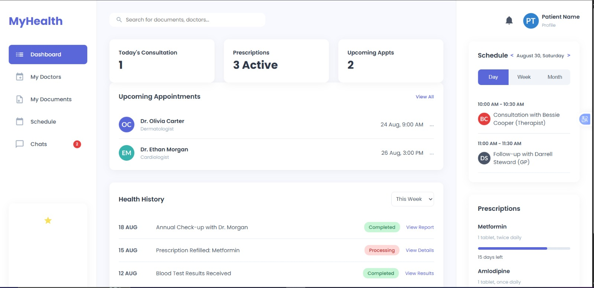
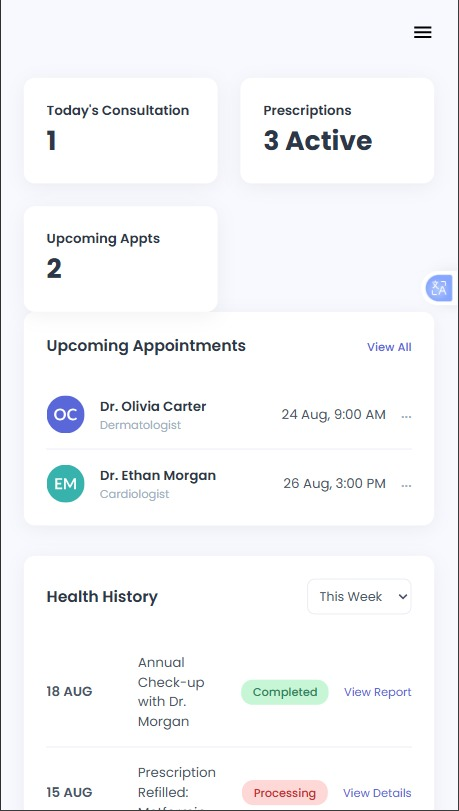

# Patients Portal

## Overview
A web-based portal designed to manage and present patient-related information in a structured and accessible format. This website connects Patients and Doctors

## Problem It Solves
Healthcare systems require organized platforms to:
- Store patient information
- Provide easy access to records
- Improve efficiency in managing data
- Easy access to heaithcare providers

## Features
- Structured patient data display
- Patients checkup schedule
- Clean and organized interface
- Responsive design

## Problems I Solved
- Organized complex information clearly
- Designed layout for easy navigation
- Improved readability of data

## Preview

## Technologies Used
- HTML
- CSS

## How to Use
1. Open the portal
2. View patient-related information
3. Navigate through sections

## Future Improvements
- Add secure authentication
- Integrate database
- Improve data management features

## Lessons Learned
- Designing systems for real-world applications
- Structuring data effectively
- Improving user experience

## Live Demo
[View Live Project](https://amarachi-victoria.github.io/PATIENTS-PORTAL/)
